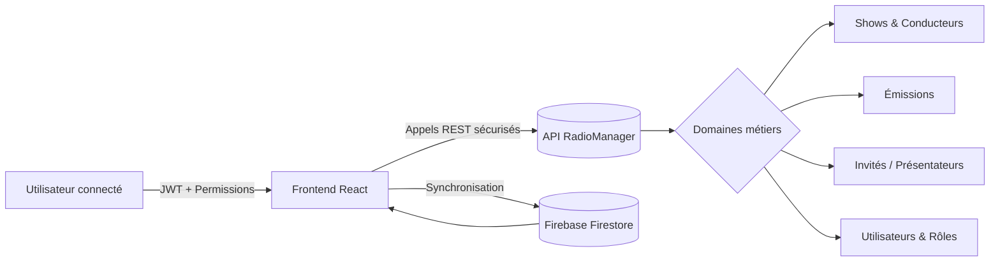

# Documentation Métier RadioManager SaaS

## Informations contextuelles
- **Domaine d'activité** : Gestion de programmation radio (émissions, conducteurs, invités, équipes) pour une station ou un réseau.
- **Fonctions métiers couvertes** : Authentification & droits, gestion des conducteurs (show plans), gestion des émissions, gestion des intervenants (invités, animateurs), administration des utilisateurs & rôles.
- **Niveau de détail** : Orientation architecte / lead dev – description fonctionnelle appuyée sur les flux techniques (structures de données, appels API).
- **Audience cible** : Développeurs backend/frontend, architectes, analystes métiers pilotant l'évolution du produit.

## Table des matières
1. [Vue d'ensemble](#vue-densemble)
2. [Cartographie des modules métiers](#cartographie-des-modules-métiers)
3. [Documents détaillés](#documents-détaillés)
   - [Authentification & contrôle d'accès](authentication-and-access.md)
   - [Programmation & conducteurs](programming-and-scheduling.md)
   - [Émissions & catalogue de contenus](emissions-and-content.md)
   - [Intervenants & collaboration](talent-and-collaboration.md)
   - [Utilisateurs & rôles](user-and-permissions.md)

## Vue d'ensemble
RadioManager est un front-end React/Vite qui orchestre la gestion quotidienne d'une station : planification des programmes, suivi des autorisations et coordination des équipes éditoriales. L'application consomme une API REST (`https://api.cloud.audace.ovh`) protégée par bearer token.

## Cartographie des modules métiers
| Module | Objectif métier | Services/API clés | Stores / composants majeurs |
| --- | --- | --- | --- |
| Authentification & contrôle d'accès | Garantir l'identité, les permissions et la synchronisation multi-support | `src/api/auth/authApi.ts`, `logoutApi` | `src/store/useAuthStore.ts`, pages `Login.tsx` |
| Programmation & conducteurs | Construire, éditer et diffuser les conducteurs d'émissions | `src/services/api/shows.ts`, `status.ts` | `src/pages/ShowPlans.tsx`, `src/components/rundowns/*` |
| Émissions & catalogue | Maintenir le référentiel d'émissions récurrentes | `src/services/api/emissions.ts` | `src/pages/Emissions` (à travers `Settings.tsx`) |
| Intervenants & collaboration | Centraliser invités, présentateurs et recherches liées | `src/services/api/guests.ts`, `presenters.ts` | `src/pages/Guests.tsx`, `src/pages/team/*` |
| Utilisateurs & rôles | Administrer les comptes, rôles et réinitialisations | `src/services/api/users.ts`, `roles.ts` | `src/pages/users/*`, `src/pages/Settings.tsx` |

## Documents détaillés
Chaque fiche métier décrit : responsabilités, données manipulées, règles spécifiques, dépendances et cas d'usage. Reportez-vous aux sous-documents listés ci-dessous.

- [Authentification & contrôle d'accès](authentication-and-access.md)
- [Programmation & conducteurs](programming-and-scheduling.md)
- [Émissions & catalogue de contenus](emissions-and-content.md)
- [Intervenants & collaboration](talent-and-collaboration.md)
- [Utilisateurs & rôles](user-and-permissions.md)
