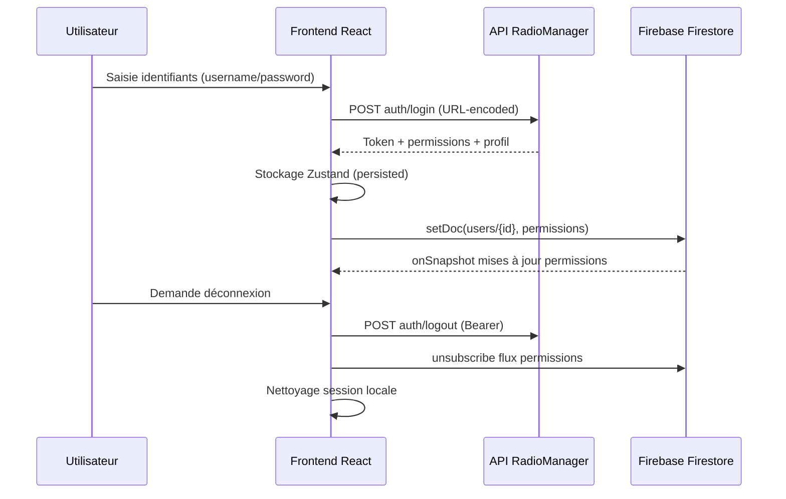

# Authentification & contrôle d'accès

## Diagramme de flux principal

## Tableau de correspondance des services
| Fonction | Fichier | Endpoint/mécanisme | Notes |
| --- | --- | --- | --- |
| `authApi` | `src/api/auth/authApi.ts` | `POST auth/login` | Retourne token + permissions riche |
| `logoutApi` | `src/api/auth/authApi.ts` | `POST auth/logout` | Tolère 401/403 (token déjà invalidé) |
| `login` | `src/store/useAuthStore.ts` | Appelle `authApi`, synchronise Firestore | Persiste état dans localStorage |
| `logout` | `src/store/useAuthStore.ts` | Appelle `logoutApi`, `signOut(Firebase)` | Nettoie stockage et unsubscribe |
| `syncPermissionsWithFirestore` | `src/store/useAuthStore.ts` | `setDoc` Firestore | Publie permissions pour consommation temps réel |

## Fonctions métiers détaillées

### Authentifier un utilisateur
- **Description** : Valide les identifiants et initialise la session applicative.
- **Responsabilités**
  - Envoyer les identifiants via `authApi` (form-urlencoded).
  - Stocker utilisateur, token et permissions dans le store persistant.
  - Lancer la synchronisation des permissions dans Firestore et s'abonner aux mises à jour.
- **Données manipulées**
  - **Entrée** : `{ username: string, password: string }` (voir `LoginCredentials`).
  - **Sortie** : `{ token: string, permissions: LoginResponse['permissions'], user }`.
- **Règles métiers**
  - Échec 401 ⇨ message "Nom d'utilisateur ou mot de passe incorrect".
  - Les permissions de l'API définissent l'accès aux sections (ex. `can_acces_showplan_section`).
  - Le `user.id` est tiré de `permissions.user_id` (numérique -> string).
- **Dépendances**
  - `authApi`, `useAuthStore`, Firestore (`db`) et Firebase Auth pour la cohérence multi-support.
- **Cas d'usage**
  1. Connexion à l'interface radio manager.
  2. Basculer entre plusieurs sessions sur la même machine (token et permissions mis à jour).

### Synchroniser les permissions en temps réel
- **Description** : Maintient la cohérence des permissions entre API et Firestore.
- **Responsabilités**
  - Écrire les permissions actuelles dans Firestore (`setDoc` users/{id}).
  - Écouter les modifications Firestore (`onSnapshot`) pour répliquer les changements dynamiques dans l'application.
  - Gérer les erreurs de synchronisation et reporter l'état de chargement.
- **Données manipulées**
  - **Entrée** : état courant du store (`user`, `token`, `permissions`).
  - **Sortie** : Document Firestore fusionné `{ permissions, updatedAt }`.
- **Règles métiers**
  - Exécuter uniquement si `user`, `token` et `permissions` sont présents.
  - En cas d'erreur Firestore, l'état `error` est renseigné mais la session demeure active.
- **Dépendances**
  - Firestore (`doc`, `setDoc`, `onSnapshot`).
- **Cas d'usage**
  1. Révoquer / attribuer des permissions depuis une console externe, synchronisation immédiate sur les clients.
  2. Préparer une bascule de rôle en direct pendant une émission.

### Gérer la déconnexion sécurisée
- **Description** : Invalide le token serveur, coupe les flux temps réel et purge la session locale.
- **Responsabilités**
  - Appeler `logoutApi` avec le token courant.
  - Se désinscrire de Firestore (`unsubscribe`).
  - Déconnecter l'utilisateur Firebase (fallback).
  - Réinitialiser le store et vider `localStorage` (`auth-storage`).
- **Données manipulées**
  - **Entrée** : token courant.
  - **Sortie** : aucune (nettoyage d'état).
- **Règles métiers**
  - 401/403 sur `logoutApi` ⇨ déconnexion considérée comme réussie.
  - En cas d'erreur Firebase, on poursuit la purge locale.
- **Dépendances**
  - `logoutApi`, Firebase Auth, Firestore subscription.
- **Cas d'usage**
  1. Déconnexion volontaire de l'utilisateur.
  2. Rotation des tokens suite à suspicion de compromission.

### Réinitialiser un mot de passe
- **Description** : Gère le cycle de vie des jetons de réinitialisation.
- **Responsabilités**
  - Générer un jeton côté admin (`usersApi.generateResetToken`).
  - Valider le jeton avant saisie du nouveau mot de passe (`usersApi.validateResetToken`).
  - Appliquer le nouveau mot de passe (`usersApi.resetPassword`).
- **Données manipulées**
  - **Entrée** : `user_id`, `reset_token`, `new_password`.
  - **Sortie** : `{ reset_token, expires_at }` ou message de confirmation.
- **Règles métiers**
  - Les appels `generateResetToken` nécessitent un token admin valide.
  - `validateResetToken` est accessible sans token (lien envoyé au bénéficiaire).
- **Dépendances**
  - `src/services/api/users.ts` (méthodes dédiées).
- **Cas d'usage**
  1. Support helpdesk qui prépare un lien de réinitialisation pour un journaliste.
  2. Gestion automatique lors de l'onboarding d'un nouveau collaborateur.
