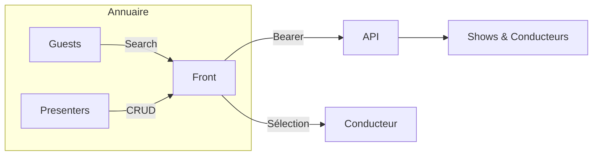

# Intervenants & collaboration

## Diagramme collaboratif

## Tableau des opérations
| Fonction | Fichier | Endpoint | Description |
| --- | --- | --- | --- |
| `guestApi.search` | `src/services/api/guests.ts` | `GET /guests/search` | Recherche d'invités |
| `presenterApi.getAll` | `src/services/api/presenters.ts` | `GET /presenters/all` | Liste paginée des présentateurs |
| `presenterApi.getById` | `GET /presenters/{id}` | Fiche détaillée |
| `presenterApi.getByUserId` | `GET /presenters/by-user/{userId}` | Lien compte utilisateur ↔ présentateur |
| `presenterApi.create` | `POST /presenters/` | Création d'un animateur/présentateur |
| `presenterApi.createOrReassign` | `POST /presenters/assign` | Rattacher un compte utilisateur existant |
| `presenterApi.update` | `PUT /presenters/update/{id}` | Mise à jour des informations |
| `presenterApi.delete` | `DELETE /presenters/del/{id}` | Suppression logique |

## Fonctions métiers détaillées

### Rechercher un invité
- **Description** : Retrouver rapidement un intervenant via le moteur interne.
- **Responsabilités**
  - Formuler la requête (`query`) et l'envoyer avec les bons headers.
  - Mapper la réponse `response.data.data` vers `Guest[]`.
- **Données manipulées**
  - **Entrée** : `{ token, query }`.
  - **Sortie** : `Guest[]` (cf. `src/types/guest.ts`).
- **Règles métiers**
  - Le moteur retourne uniquement les invités autorisés par le profil (`can_view_guests`).
  - Les résultats peuvent être utilisés pour pré-remplir les segments de conducteur (`guest.id`).
- **Dépendances**
  - `guestApi.search`, store `useGuestStore` (ajout/mise à jour local).
- **Cas d'usage**
  1. Associer un invité récurrent à une chronique.
  2. Vérifier la disponibilité d'un intervenant avant de l'inviter.

### Gérer le vivier de présentateurs
- **Description** : Maintenir la liste des animateurs / journalistes pouvant être affectés à une émission.
- **Responsabilités**
  - Charger la liste complète (`presenterApi.getAll`) pour les pages d'administration.
  - Consulter une fiche individuelle (`getById` ou `getByUserId`).
  - Créer ou réassigner un présentateur à partir d'un compte utilisateur.
  - Mettre à jour les informations de contact et biographies.
  - Supprimer logiquement un présentateur inactif.
- **Données manipulées**
  - **Entrée** : `CreatePresenterData` ou `Partial<CreatePresenterData>` selon l'action.
  - **Sortie** : `PresenterResponse` (données complètes). 
- **Règles métiers**
  - Permissions : `can_view_presenters`, `can_edit_presenters`, `can_delete_presenters`.
  - Les champs `contact_info`, `biography`, `profilePicture` sont optionnels mais normalisés (`null` si absents).
  - `createOrReassign` permet de réactiver un présentateur existant sans dupliquer les entrées.
- **Dépendances**
  - `presenterApi`, composants `team/PresenterList`, `forms/PresenterForm`.
- **Cas d'usage**
  1. Onboarding d'un nouveau journaliste dans la station.
  2. Mise à jour des coordonnées d'un animateur suite à un changement interne.

### Affecter des intervenants à un conducteur
- **Description** : Lier invités et présentateurs aux segments d'un conducteur.
- **Responsabilités**
  - Utiliser les résultats `guestApi.search` pour alimenter les segments.
  - Mapper les ID de présentateurs retournés par `presenterApi` vers la structure `ShowPlan.presenters`.
- **Données manipulées**
  - **Entrée** : `Guest.id`, `PresenterResponse.id`.
  - **Sortie** : segments enrichis (`guests: string[]`, `presenters: Presenter[]`).
- **Règles métiers**
  - L'invité peut apparaître dans plusieurs segments ; la logique front gère la déduplication.
  - Les permissions showplan conditionnent la possibilité d'assigner (`can_edit_showplan`).
- **Dépendances**
  - `showsApi` (pour persister), `presenterApi`, `guestApi`.
- **Cas d'usage**
  1. Assignation d'un chroniqueur à sa chronique hebdomadaire.
  2. Ajout d'un invité surprise à un segment "Interview".
