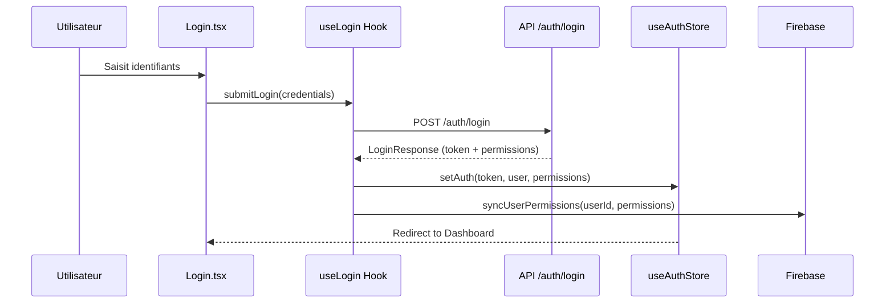
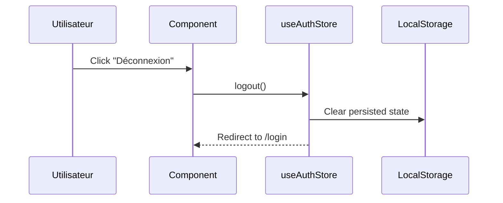

# 🔐 Module Authentification

> Gestion de la connexion, déconnexion, et synchronisation des permissions utilisateur.

## 📋 Vue d'ensemble

| Aspect | Valeur |
|--------|--------|
| **Pages** | `Login.tsx` |
| **Stores** | `useAuthStore` |
| **Hooks** | `useLogin`, `useLogout`, `useAuthCheck` |
| **Services API** | `src/api/auth.ts` |
| **Firebase** | Synchronisation permissions |

## 🎯 Fonctionnalités

### 1. Connexion utilisateur



### 2. Déconnexion



### 3. Vérification de session

- Automatique au chargement de l'application
- Redirige vers `/login` si token invalide ou expiré
- Gère l'erreur 401 automatiquement

## 📁 Structure des fichiers

```
src/
├── api/
│   └── auth.ts                    # Service d'authentification
├── hooks/
│   └── auth/
│       ├── useLogin.ts            # Hook de connexion
│       ├── useLogout.ts           # Hook de déconnexion
│       └── useAuthCheck.ts        # Vérification session
├── store/
│   └── useAuthStore.ts            # Store Zustand
├── pages/
│   └── Login.tsx                  # Page de connexion
├── types/
│   └── auth.ts                    # Types TypeScript
└── schemas/
    └── authSchema.ts              # Validation Zod
```

## 🔒 Contraintes et règles métier

### Authentification

| Règle | Description |
|-------|-------------|
| **Token JWT** | Bearer token dans header `Authorization` |
| **Expiration** | Gérée par le backend (401 Unauthorized) |
| **Persistance** | Token stocké en localStorage via Zustand persist |
| **Déconnexion auto** | Sur erreur 401, redirection vers login |

### Permissions

| Règle | Description |
|-------|-------------|
| **46 permissions** | Booléens retournés par l'API au login |
| **Granularité** | Par fonctionnalité (CRUD) et par entité |
| **Sync Firebase** | Permissions syncées vers Firestore pour le chat |
| **Vérification client** | Côté frontend uniquement (UX) |
| **Vérification serveur** | Le backend re-vérifie chaque requête |

## 📊 Types TypeScript

### LoginCredentials

```typescript
interface LoginCredentials {
  username: string;
  password: string;
}
```

### LoginResponse

```typescript
interface LoginResponse {
  access_token: string;
  token_type: string;
  username: string;
  email: string;
  family_name: string;
  name: string;
  phone_number: string | null;
  permissions: UserPermissions;
}
```

### UserPermissions (46 permissions)

```typescript
interface UserPermissions {
  user_id: number;
  
  // Conducteurs (13)
  can_acces_showplan_broadcast_section: boolean;
  can_acces_showplan_section: boolean;
  can_create_showplan: boolean;
  can_edit_showplan: boolean;
  can_archive_showplan: boolean;
  can_archiveStatusChange_showplan: boolean;
  can_delete_showplan: boolean;
  can_destroy_showplan: boolean;
  can_changestatus_showplan: boolean;
  can_changestatus_owned_showplan: boolean;
  can_changestatus_archived_showplan: boolean;
  can_setOnline_showplan: boolean;
  can_viewAll_showplan: boolean;
  
  // Utilisateurs (7)
  can_acces_users_section: boolean;
  can_view_users: boolean;
  can_edit_users: boolean;
  can_desable_users: boolean;
  can_delete_users: boolean;
  can_manage_roles: boolean;
  can_assign_roles: boolean;
  
  // Invités (4)
  can_acces_guests_section: boolean;
  can_view_guests: boolean;
  can_edit_guests: boolean;
  can_delete_guests: boolean;
  
  // Animateurs (4)
  can_acces_presenters_section: boolean;
  can_view_presenters: boolean;
  can_edit_presenters: boolean;
  can_delete_presenters: boolean;
  
  // Émissions (6)
  can_acces_emissions_section: boolean;
  can_view_emissions: boolean;
  can_create_emissions: boolean;
  can_edit_emissions: boolean;
  can_delete_emissions: boolean;
  can_manage_emissions: boolean;
  
  // Système (5)
  can_view_notifications: boolean;
  can_manage_notifications: boolean;
  can_view_audit_logs: boolean;
  can_view_login_history: boolean;
  can_manage_settings: boolean;
  
  // Messages/Fichiers (6)
  can_view_messages: boolean;
  can_send_messages: boolean;
  can_delete_messages: boolean;
  can_view_files: boolean;
  can_upload_files: boolean;
  can_delete_files: boolean;
  
  granted_at: string;
}
```

## 🔌 Endpoints API

| Méthode | Endpoint | Description |
|---------|----------|-------------|
| `POST` | `/auth/login` | Connexion utilisateur |
| `POST` | `/auth/generate-reset-token` | Génère token reset password |
| `GET` | `/auth/reset-token/validate` | Valide token reset |
| `POST` | `/auth/reset-password` | Reset mot de passe |

### Exemple de requête login

```typescript
// src/api/auth.ts
import api from './api';
import type { LoginCredentials, LoginResponse } from '../types/auth';

export const login = async (credentials: LoginCredentials): Promise<LoginResponse> => {
  const formData = new URLSearchParams();
  formData.append('username', credentials.username);
  formData.append('password', credentials.password);

  const response = await api.post<LoginResponse>('/auth/login', formData, {
    headers: { 'Content-Type': 'application/x-www-form-urlencoded' }
  });

  return response.data;
};
```

## 🗃️ Store Zustand

### État

```typescript
interface AuthState {
  token: string | null;
  user: {
    id: number;
    username: string;
    email: string;
    name: string;
    family_name: string;
  } | null;
  permissions: UserPermissions | null;
  isAuthenticated: boolean;
}
```

### Actions

| Action | Description |
|--------|-------------|
| `setAuth(token, user, permissions)` | Définit l'état d'authentification |
| `logout()` | Efface l'état et redirige vers login |
| `updatePermissions(permissions)` | Met à jour les permissions |

### Persistance

```typescript
persist(
  (set) => ({ /* state */ }),
  {
    name: 'auth-storage',
    partialize: (state) => ({
      token: state.token,
      user: state.user,
      permissions: state.permissions,
    }),
  }
)
```

## 🔥 Synchronisation Firebase

### Structure Firestore

```
/permissions/{userId}
{
  user_id: number,
  can_view_messages: boolean,
  can_send_messages: boolean,
  // ... autres permissions
  synced_at: timestamp
}
```

### Logique de synchronisation

```typescript
// Après login réussi
const syncUserPermissions = async (userId: number, permissions: UserPermissions) => {
  const permRef = doc(db, 'permissions', String(userId));
  await setDoc(permRef, {
    ...permissions,
    synced_at: serverTimestamp()
  });
};
```

## ⚠️ Gestion des erreurs

| Code | Erreur | Action |
|------|--------|--------|
| `401` | Non autorisé / Token expiré | Logout + redirect `/login` |
| `403` | Accès interdit | Message d'erreur |
| `422` | Données invalides | Afficher erreurs de validation |
| `500` | Erreur serveur | Message générique |

## 🧪 Points de test

- [ ] Login avec identifiants valides
- [ ] Login avec identifiants invalides
- [ ] Persistance token après refresh page
- [ ] Déconnexion efface le token
- [ ] Redirect automatique sur 401
- [ ] Permissions correctement stockées
- [ ] Sync Firebase fonctionne

## 📝 Exemple d'utilisation

### Vérification d'authentification

```typescript
// Dans un composant protégé
import { useAuthStore } from '../store/useAuthStore';
import { Navigate } from 'react-router-dom';

const ProtectedComponent = () => {
  const { isAuthenticated, permissions } = useAuthStore();

  if (!isAuthenticated) {
    return <Navigate to="/login" />;
  }

  if (!permissions?.can_acces_showplan_section) {
    return <AccessDenied message="Vous n'avez pas accès à cette section" />;
  }

  return <ShowPlansContent />;
};
```

### Hook useLogin

```typescript
// src/hooks/auth/useLogin.ts
export const useLogin = () => {
  const navigate = useNavigate();
  const setAuth = useAuthStore((state) => state.setAuth);
  const [isLoading, setIsLoading] = useState(false);
  const [error, setError] = useState<string | null>(null);

  const submitLogin = async (credentials: LoginCredentials) => {
    setIsLoading(true);
    setError(null);
    try {
      const response = await login(credentials);
      setAuth(response.access_token, {
        id: response.permissions.user_id,
        username: response.username,
        email: response.email,
        name: response.name,
        family_name: response.family_name,
      }, response.permissions);
      navigate('/dashboard');
    } catch (err) {
      setError('Identifiants incorrects');
    } finally {
      setIsLoading(false);
    }
  };

  return { submitLogin, isLoading, error };
};
```
