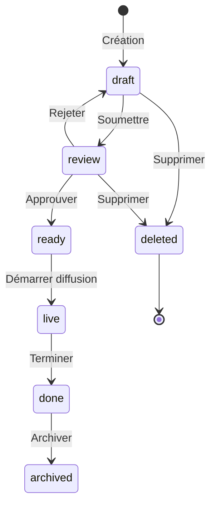

# 📝 Module Conducteurs (Show Plans)

> Gestion complète des conducteurs d'émission : création, édition, workflow de statuts, archivage.

## 📋 Vue d'ensemble

| Aspect | Valeur |
|--------|--------|
| **Pages** | `ShowPlans.tsx`, `MyShowPlans.tsx`, `CreateShowPlan.tsx`, `EditShowPlan.tsx`, `ShowPlanDetail.tsx` |
| **Store** | `useShowPlanStore` |
| **Hook** | `useShows` |
| **Service API** | `src/services/api/shows.ts` |
| **Composants** | `src/components/showPlans/*` |

## 🎯 Fonctionnalités

### 1. Liste des conducteurs

- **Vue grille** : Cards avec aperçu visuel
- **Vue liste** : Tableau compact
- **Filtres** : Par statut, date, émission, animateur
- **Recherche** : Par titre
- **Tri** : Date de diffusion (asc/desc)

### 2. Création de conducteur

1. Sélection de l'émission parente
2. Définition des métadonnées (titre, date, durée)
3. Assignation des animateurs
4. Création des segments avec invités
5. Sauvegarde en brouillon

### 3. Édition de conducteur

- Modification de toutes les informations
- Ajout/suppression de segments
- Réorganisation par drag & drop
- Gestion des invités par segment

### 4. Workflow de statuts



### 5. Mes conducteurs

- Liste filtrée par propriétaire (user connecté)
- Accès via `can_changestatus_owned_showplan`

## 📁 Structure des fichiers

```
src/
├── pages/
│   ├── ShowPlans.tsx              # Liste tous les conducteurs
│   ├── MyShowPlans.tsx            # Mes conducteurs
│   ├── CreateShowPlan.tsx         # Création
│   ├── EditShowPlan.tsx           # Modification
│   └── ShowPlanDetail.tsx         # Vue détaillée
├── hooks/
│   └── shows/
│       └── useShows.ts            # Hook principal
├── store/
│   └── useShowPlanStore.ts        # État Zustand
├── services/
│   └── api/
│       └── shows.ts               # Appels API
├── components/
│   └── showPlans/
│       ├── ShowPlanCard.tsx       # Card vue grille
│       ├── ShowPlanList.tsx       # Liste complète
│       ├── ShowPlanListView.tsx   # Vue liste
│       ├── ShowPlanFilters.tsx    # Filtres
│       ├── StatusBadge.tsx        # Badge de statut
│       ├── StatusSelect.tsx       # Sélecteur de statut
│       ├── StatusTransition.tsx   # Transitions valides
│       ├── detail/                # Composants détail
│       ├── forms/                 # Formulaires
│       ├── guests/                # Gestion invités
│       ├── presenters/            # Gestion animateurs
│       └── segments/              # Gestion segments
├── types/
│   └── index.ts                   # ShowPlan, Segment, etc.
└── schemas/
    └── showPlanSchema.ts          # Validation Zod
```

## 🔒 Contraintes et règles métier

### Permissions requises

| Action | Permission | Description |
|--------|------------|-------------|
| Voir section | `can_acces_showplan_section` | Accès à la page |
| Voir tous | `can_viewAll_showplan` | Liste complète |
| Créer | `can_create_showplan` | Nouveau conducteur |
| Éditer | `can_edit_showplan` | Modifier existant |
| Changer statut | `can_changestatus_showplan` | Tous les statuts |
| Changer statut (owned) | `can_changestatus_owned_showplan` | Ses conducteurs |
| Archiver | `can_archive_showplan` | Passer en archive |
| Supprimer | `can_delete_showplan` | Soft delete |
| Détruire | `can_destroy_showplan` | Hard delete |

### Règles de statut

| Statut | Transitions possibles | Permissions |
|--------|----------------------|-------------|
| `draft` | review, deleted | Créateur ou admin |
| `review` | draft, ready, deleted | Validateur |
| `ready` | live | Responsable diffusion |
| `live` | done | Automatique ou manuel |
| `done` | archived | Archiveur |
| `archived` | - | Consultation seule |

### Contraintes de données

| Champ | Contrainte |
|-------|------------|
| `title` | Requis, max 200 caractères |
| `emission_id` | Requis, doit exister |
| `broadcast_date` | Requis, format ISO |
| `duration` | Requis, en minutes, > 0 |
| `presenters` | Au moins 1 animateur |
| `segments` | Position unique et ordonnée |

## 📊 Types TypeScript

### ShowPlan

```typescript
interface ShowPlan {
  id: string;
  title: string;
  type: ShowType;
  broadcast_date: string;
  duration: number;
  frequency: string;
  description?: string;
  status: ShowStatus;
  emission: {
    id: number;
    title: string;
  };
  presenters: Presenter[];
  segments: ShowSegment[];
  created_at: string;
  updated_at: string;
  created_by: number;
}
```

### ShowSegment

```typescript
interface ShowSegment {
  id: string;
  title: string;
  type: SegmentType;
  duration: number;
  position: number;
  startTime?: string;
  description?: string;
  technical_notes?: string;
  guests: Guest[];
}
```

### ShowStatus

```typescript
type ShowStatus = 
  | 'draft'      // Brouillon
  | 'review'     // En révision
  | 'ready'      // Prêt à diffuser
  | 'live'       // En direct
  | 'done'       // Terminé
  | 'archived'   // Archivé
  | 'deleted';   // Supprimé
```

### ShowType

```typescript
type ShowType = 
  | 'talk'       // Discussion
  | 'music'      // Musical
  | 'news'       // Actualités
  | 'interview'  // Interview
  | 'mixed';     // Mixte
```

### SegmentType

```typescript
type SegmentType =
  | 'intro'           // Introduction
  | 'interview'       // Interview
  | 'music'           // Musique
  | 'news'            // Actualités
  | 'advertisement'   // Publicité
  | 'transition'      // Transition
  | 'outro';          // Conclusion
```

### CreateShowPlanPayload

```typescript
interface CreateShowPlanPayload {
  title: string;
  type: string;
  broadcast_date: string;
  duration: number;
  frequency: string;
  description?: string;
  status: string;
  emission_id: number;
  presenter_ids: number[];
  segments: {
    title: string;
    type: string;
    position: number;
    duration: number;
    description?: string;
    guest_ids: number[];
  }[];
}
```

## 🔌 Endpoints API

| Méthode | Endpoint | Description |
|---------|----------|-------------|
| `GET` | `/showplans/` | Liste tous les conducteurs |
| `GET` | `/showplans/owned` | Mes conducteurs |
| `GET` | `/showplans/id/{id}` | Détail d'un conducteur |
| `POST` | `/showplans/` | Créer un conducteur |
| `PUT` | `/showplans/upd/{id}` | Modifier un conducteur |
| `DELETE` | `/showplans/softDel/{id}` | Soft delete |
| `DELETE` | `/showplans/hardDel/{id}` | Hard delete |
| `PATCH` | `/showplans/{id}/status` | Changer le statut |

### Exemple de création

```typescript
const createShowPlan = async (token: string, data: CreateShowPlanPayload) => {
  const response = await api.post('showplans/', data, {
    headers: { Authorization: `Bearer ${token}` },
  });
  return response.data;
};
```

## 🪝 Hook useShows

```typescript
export const useShows = () => {
  const token = useAuthStore((state) => state.token);
  const location = useLocation();

  const [shows, setShows] = useState([]);
  const [isLoading, setLoading] = useState(true);
  const [error, setError] = useState<Error | null>(null);

  useEffect(() => {
    if (!token) return;

    const fetchShows = async () => {
      setLoading(true);
      try {
        let response;
        
        // Route différente selon le chemin
        if (location.pathname.startsWith('/my-show-plans')) {
          response = await showsApi.getAll_Owned(token);
        } else if (location.pathname.startsWith('/show-plans')) {
          response = await showsApi.getAll_production(token);
        }

        setShows(response || []);
      } catch (err: any) {
        setError(err.response?.data?.message || 'Erreur');
      } finally {
        setLoading(false);
      }
    };

    fetchShows();
  }, [token, location.pathname]);

  return { shows, isLoading, error };
};
```

## 🗃️ Service API (shows.ts)

### Mapping des types

```typescript
// Conversion types API → Frontend
const mapShowType = (apiType: string | null | undefined): ShowType => {
  if (!apiType) return 'talk';
  const typeMap: Record<string, ShowType> = {
    'Débat': 'talk',
    'Musique': 'music',
    'Actualités': 'news',
    'Interview': 'interview',
    'Mixte': 'mixed',
  };
  return typeMap[apiType] || 'talk';
};

const mapSegmentType = (apiType: string | null | undefined): SegmentType => {
  if (!apiType) return 'intro';
  const typeMap: Record<string, SegmentType> = {
    'Introduction': 'intro',
    'Interview': 'interview',
    'Musique': 'music',
    'Actualités': 'news',
    'Publicité': 'advertisement',
    'Transition': 'transition',
    'Conclusion': 'outro',
  };
  return typeMap[apiType] || 'intro';
};
```

### Fonctions principales

```typescript
export const showsApi = {
  getAll_production: async (token: string): Promise<ShowPlan[]>,
  getAll_Owned: async (token: string): Promise<ShowPlan[]>,
  getById: async (token: string, id: number): Promise<ShowPlan>,
  create: async (token: string, data: CreateShowPlanPayload): Promise<ShowPlan>,
  update: async (token: string, id: number, data: UpdateShowPlanPayload): Promise<ShowPlan>,
  delete: async (token: string, id: number): Promise<void>,
  updateStatus: async (token: string, id: number, status: ShowStatus): Promise<void>,
};
```

## 🎨 Interface utilisateur

### Vue grille (ShowPlanCard)

```
┌─────────────────────────────────────────┐
│ [StatusBadge: ready]            📅 15/01│
├─────────────────────────────────────────┤
│ Matinale Info - Édition spéciale        │
│ 📻 Émission: Matinale                   │
│ ⏱️ 180 min                              │
│ 👤 Jean Dupont, Marie Martin            │
├─────────────────────────────────────────┤
│ [Voir] [Éditer] [Statut ▼]              │
└─────────────────────────────────────────┘
```

### Vue liste (ShowPlanListView)

| Date | Titre | Émission | Durée | Animateurs | Statut | Actions |
|------|-------|----------|-------|------------|--------|---------|
| 15/01 | Matinale spéciale | Matinale | 180m | Jean D. | ready | 👁️ ✏️ |

### Filtres disponibles

- **Statut** : All, Draft, Review, Ready, Live, Done, Archived
- **Date** : Today, Tomorrow, This Week, This Month, Custom
- **Émission** : Dropdown liste émissions
- **Animateur** : Dropdown liste animateurs
- **Recherche** : Texte libre sur titre

## ⚠️ Gestion des erreurs

| Erreur | Comportement |
|--------|--------------|
| 401 | Logout + redirect |
| 403 | Message "Accès refusé" |
| 404 | Message "Conducteur non trouvé" |
| 422 | Afficher erreurs validation |
| Transition invalide | Message + bloquer action |

## 🔄 Store Zustand

### État

```typescript
interface ShowPlanState {
  currentShowPlan: ShowPlan | null;
  isLoading: boolean;
  error: string | null;
  segments: ShowSegment[];
  presenters: Presenter[];
}
```

### Actions

| Action | Description |
|--------|-------------|
| `setShowPlan(plan)` | Définit le conducteur courant |
| `addSegment(segment)` | Ajoute un segment |
| `updateSegment(id, data)` | Met à jour un segment |
| `removeSegment(id)` | Supprime un segment |
| `reorderSegments(ids)` | Réordonne les segments |
| `addPresenter(presenter)` | Ajoute un animateur |
| `removePresenter(id)` | Retire un animateur |
| `clearShowPlan()` | Réinitialise l'état |

## 🧪 Points de test

- [ ] Création avec tous les champs requis
- [ ] Validation Zod fonctionne
- [ ] Transitions de statut respectées
- [ ] Permissions vérifiées sur actions
- [ ] Drag & drop segments fonctionne
- [ ] Filtres combinent correctement
- [ ] Vue grille/liste toggle
- [ ] Responsive mobile

## 📝 Exemples d'utilisation

### Page ShowPlans

```tsx
const ShowPlans = () => {
  const { shows, isLoading, error } = useShows();
  const { permissions } = useAuthStore();
  const [viewMode, setViewMode] = useState<'grid' | 'list'>('grid');
  const [filters, setFilters] = useState<ShowFilters>({});

  if (!permissions?.can_acces_showplan_section) {
    return <AccessDenied />;
  }

  const filteredShows = useMemo(() => {
    return shows.filter(show => {
      if (filters.status && show.status !== filters.status) return false;
      if (filters.search && !show.title.includes(filters.search)) return false;
      return true;
    });
  }, [shows, filters]);

  return (
    <Layout>
      <Header>
        <h1>Conducteurs</h1>
        {permissions.can_create_showplan && (
          <Link to="/show-plans/create">
            <Button>Nouveau conducteur</Button>
          </Link>
        )}
      </Header>

      <ShowPlanFilters 
        filters={filters} 
        onChange={setFilters}
        viewMode={viewMode}
        onViewModeChange={setViewMode}
      />

      {viewMode === 'grid' ? (
        <div className="grid grid-cols-1 md:grid-cols-2 lg:grid-cols-3 gap-4">
          {filteredShows.map(show => (
            <ShowPlanCard key={show.id} show={show} />
          ))}
        </div>
      ) : (
        <ShowPlanListView shows={filteredShows} />
      )}
    </Layout>
  );
};
```

### Création de conducteur

```tsx
const CreateShowPlan = () => {
  const { token, permissions } = useAuthStore();
  const navigate = useNavigate();
  const [formData, setFormData] = useState<CreateShowPlanPayload>({
    title: '',
    type: 'talk',
    broadcast_date: '',
    duration: 60,
    frequency: 'daily',
    status: 'draft',
    emission_id: 0,
    presenter_ids: [],
    segments: [],
  });

  const handleSubmit = async () => {
    try {
      await showsApi.create(token!, formData);
      navigate('/show-plans');
    } catch (error) {
      console.error('Création échouée', error);
    }
  };

  return (
    <Form onSubmit={handleSubmit}>
      <EmissionSelect 
        value={formData.emission_id}
        onChange={(id) => setFormData({...formData, emission_id: id})}
      />
      <Input 
        label="Titre"
        value={formData.title}
        onChange={(e) => setFormData({...formData, title: e.target.value})}
      />
      <DatePicker 
        label="Date de diffusion"
        value={formData.broadcast_date}
        onChange={(date) => setFormData({...formData, broadcast_date: date})}
      />
      <PresenterSelect 
        selected={formData.presenter_ids}
        onChange={(ids) => setFormData({...formData, presenter_ids: ids})}
      />
      <SegmentBuilder 
        segments={formData.segments}
        onChange={(segments) => setFormData({...formData, segments})}
      />
      <Button type="submit">Créer</Button>
    </Form>
  );
};
```
