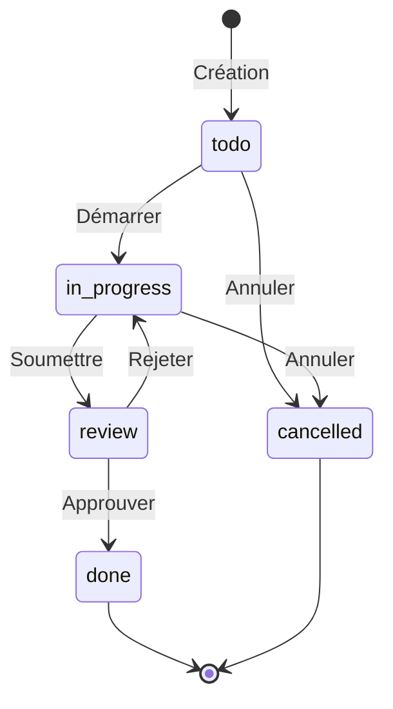

# ✅ Module Tâches

> Gestion des tâches en mode Kanban avec drag & drop, commentaires et assignation.

## 📋 Vue d'ensemble

| Aspect | Valeur |
|--------|--------|
| **Page** | `Tasks.tsx` |
| **Store** | `useTaskStore` |
| **Backend** | Firebase Firestore (temps réel) |
| **UI** | Kanban board avec drag & drop |

## 🎯 Fonctionnalités

### 1. Tableau Kanban

Colonnes par défaut :
- **À faire** (todo)
- **En cours** (in-progress)
- **En révision** (review)
- **Terminé** (done)

### 2. Gestion des tâches

- Création avec titre, description, priorité
- Assignation à un ou plusieurs utilisateurs
- Date d'échéance
- Tags/labels
- Pièces jointes

### 3. Drag & Drop

- Déplacer entre colonnes (changer statut)
- Réordonner dans une colonne
- Multi-sélection possible

### 4. Commentaires

- Ajout de commentaires par tâche
- Mention d'utilisateurs (@user)
- Historique des modifications

### 5. Filtres

- Par statut
- Par priorité
- Par assigné
- Par date d'échéance
- Par tags

## 📁 Structure des fichiers

```
src/
├── pages/
│   └── Tasks.tsx                  # Page principale
├── store/
│   └── useTaskStore.ts            # Store Zustand + Firebase
├── components/
│   └── tasks/
│       ├── TaskBoard.tsx          # Tableau Kanban
│       ├── TaskColumn.tsx         # Colonne de statut
│       ├── TaskCard.tsx           # Carte de tâche
│       ├── TaskForm.tsx           # Formulaire création/édition
│       ├── TaskDetail.tsx         # Vue détaillée
│       ├── TaskComments.tsx       # Section commentaires
│       ├── TaskFilters.tsx        # Filtres
│       └── TaskAssignees.tsx      # Sélection assignés
├── types/
│   └── task.ts                    # Types TypeScript
└── hooks/
    └── useTasks.ts                # Hook principal
```

## 🔒 Contraintes et règles métier

### Workflow des statuts



### Contraintes de données

| Champ | Contrainte |
|-------|------------|
| Titre | Requis, 1-200 caractères |
| Description | Optionnel, max 5000 caractères |
| Priorité | low, medium, high, urgent |
| Due date | Optionnel, format ISO |
| Assignés | 0 à N utilisateurs |
| Tags | 0 à 10 tags |

### Permissions

| Action | Qui peut |
|--------|----------|
| Voir les tâches | Tous les utilisateurs connectés |
| Créer une tâche | Tous les utilisateurs connectés |
| Modifier sa tâche | Créateur ou assigné |
| Supprimer une tâche | Créateur ou admin |
| Commenter | Tous les utilisateurs connectés |

## 📊 Types TypeScript

### Task

```typescript
interface Task {
  id: string;
  title: string;
  description?: string;
  status: TaskStatus;
  priority: TaskPriority;
  createdAt: Timestamp;
  updatedAt: Timestamp;
  dueDate?: Timestamp;
  createdBy: string;
  assignees: string[];
  tags: string[];
  comments: TaskComment[];
  attachments: TaskAttachment[];
  position: number; // Pour l'ordre dans la colonne
}
```

### TaskStatus

```typescript
type TaskStatus = 
  | 'todo'
  | 'in-progress'
  | 'review'
  | 'done'
  | 'cancelled';
```

### TaskPriority

```typescript
type TaskPriority = 
  | 'low'      // Basse
  | 'medium'   // Moyenne
  | 'high'     // Haute
  | 'urgent';  // Urgente
```

### TaskComment

```typescript
interface TaskComment {
  id: string;
  taskId: string;
  text: string;
  userId: string;
  userName: string;
  createdAt: Timestamp;
  editedAt?: Timestamp;
  mentions: string[]; // UserIds mentionnés
}
```

### TaskAttachment

```typescript
interface TaskAttachment {
  id: string;
  name: string;
  url: string;
  type: string;
  size: number;
  uploadedAt: Timestamp;
  uploadedBy: string;
}
```

### TaskFilters

```typescript
interface TaskFilters {
  status?: TaskStatus[];
  priority?: TaskPriority[];
  assignee?: string;
  dueDateFrom?: string;
  dueDateTo?: string;
  tags?: string[];
  search?: string;
}
```

## 🔥 Structure Firestore

```
firestore/
├── tasks/
│   └── {taskId}/
│       ├── title: string
│       ├── description: string
│       ├── status: string
│       ├── priority: string
│       ├── createdAt: timestamp
│       ├── updatedAt: timestamp
│       ├── dueDate: timestamp
│       ├── createdBy: string
│       ├── assignees: array<string>
│       ├── tags: array<string>
│       └── position: number
│
├── taskComments/
│   └── {commentId}/
│       ├── taskId: string
│       ├── text: string
│       ├── userId: string
│       ├── userName: string
│       ├── createdAt: timestamp
│       └── mentions: array<string>
│
└── taskAttachments/
    └── {attachmentId}/
        ├── taskId: string
        ├── name: string
        ├── url: string
        └── uploadedAt: timestamp
```

## 🗃️ Store Zustand (useTaskStore)

### État

```typescript
interface TaskState {
  tasks: Task[];
  currentTask: Task | null;
  filters: TaskFilters;
  isLoading: boolean;
  error: string | null;
}
```

### Actions principales

```typescript
interface TaskActions {
  // CRUD
  fetchTasks: () => Promise<void>;
  createTask: (data: CreateTaskData) => Promise<Task>;
  updateTask: (id: string, data: UpdateTaskData) => Promise<void>;
  deleteTask: (id: string) => Promise<void>;
  
  // Status
  moveTask: (taskId: string, newStatus: TaskStatus, newPosition: number) => Promise<void>;
  
  // Assignees
  assignUser: (taskId: string, userId: string) => Promise<void>;
  unassignUser: (taskId: string, userId: string) => Promise<void>;
  
  // Comments
  addComment: (taskId: string, text: string) => Promise<void>;
  editComment: (commentId: string, newText: string) => Promise<void>;
  deleteComment: (commentId: string) => Promise<void>;
  
  // Filters
  setFilters: (filters: TaskFilters) => void;
  clearFilters: () => void;
  
  // Selection
  selectTask: (task: Task | null) => void;
  
  // Real-time
  subscribeToTasks: () => () => void;
}
```

### Exemple d'implémentation moveTask

```typescript
const moveTask = async (taskId: string, newStatus: TaskStatus, newPosition: number) => {
  const taskRef = doc(db, 'tasks', taskId);
  
  // Mettre à jour les positions des autres tâches
  const tasksInColumn = get().tasks
    .filter(t => t.status === newStatus && t.id !== taskId)
    .sort((a, b) => a.position - b.position);
  
  const batch = writeBatch(db);
  
  // Insérer à la nouvelle position
  tasksInColumn.splice(newPosition, 0, null);
  tasksInColumn.forEach((task, index) => {
    if (task) {
      batch.update(doc(db, 'tasks', task.id), { position: index });
    }
  });
  
  // Mettre à jour la tâche déplacée
  batch.update(taskRef, {
    status: newStatus,
    position: newPosition,
    updatedAt: serverTimestamp()
  });
  
  await batch.commit();
};
```

## 🎨 Interface utilisateur

### Layout Kanban

```
┌─────────────────────────────────────────────────────────────────┐
│  Tâches                                    [+ Nouvelle tâche]   │
├─────────────────────────────────────────────────────────────────┤
│  [Filtres: Priorité ▼] [Assigné ▼] [Tags ▼]    🔍 Rechercher   │
├─────────────────────────────────────────────────────────────────┤
│  ┌─────────────┐ ┌─────────────┐ ┌─────────────┐ ┌─────────────┐│
│  │ À FAIRE (3) │ │ EN COURS (2)│ │ RÉVISION (1)│ │ TERMINÉ (5) ││
│  ├─────────────┤ ├─────────────┤ ├─────────────┤ ├─────────────┤│
│  │ ┌─────────┐ │ │ ┌─────────┐ │ │ ┌─────────┐ │ │ ┌─────────┐ ││
│  │ │ 🔴 Task1│ │ │ │ 🟡 Task4│ │ │ │ 🟢 Task6│ │ │ │ ✓ Task7 │ ││
│  │ │ @Jean   │ │ │ │ @Marie  │ │ │ │ @Pierre │ │ │ │ @Jean   │ ││
│  │ │ 📅 15/01│ │ │ │ 📅 14/01│ │ │ │         │ │ │ │         │ ││
│  │ └─────────┘ │ │ └─────────┘ │ │ └─────────┘ │ │ └─────────┘ ││
│  │ ┌─────────┐ │ │ ┌─────────┐ │ │             │ │ ┌─────────┐ ││
│  │ │ 🟡 Task2│ │ │ │ 🔴 Task5│ │ │             │ │ │ ✓ Task8 │ ││
│  │ │ @Marie  │ │ │ │ @Jean   │ │ │             │ │ │         │ ││
│  │ └─────────┘ │ │ └─────────┘ │ │             │ │ └─────────┘ ││
│  │ ┌─────────┐ │ │             │ │             │ │     ...     ││
│  │ │ 🟢 Task3│ │ │             │ │             │ │             ││
│  │ └─────────┘ │ │             │ │             │ │             ││
│  └─────────────┘ └─────────────┘ └─────────────┘ └─────────────┘│
└─────────────────────────────────────────────────────────────────┘
```

### Indicateurs de priorité

| Priorité | Couleur | Icône |
|----------|---------|-------|
| Low | 🟢 Vert | - |
| Medium | 🟡 Jaune | ! |
| High | 🟠 Orange | !! |
| Urgent | 🔴 Rouge | !!! |

### Card de tâche

```
┌─────────────────────────┐
│ 🔴 Préparer conducteur  │
├─────────────────────────┤
│ Émission du 15 janvier  │
├─────────────────────────┤
│ 👤 Jean D. 👤 Marie M.  │
│ 📅 15/01  💬 3          │
│ 🏷️ urgent, matinale     │
└─────────────────────────┘
```

## 📝 Exemple d'implémentation

### Page Tasks

```tsx
const Tasks = () => {
  const { 
    tasks, 
    filters, 
    isLoading,
    moveTask,
    setFilters,
    createTask,
    selectTask
  } = useTaskStore();

  const tasksByStatus = useMemo(() => {
    return {
      todo: tasks.filter(t => t.status === 'todo').sort((a, b) => a.position - b.position),
      'in-progress': tasks.filter(t => t.status === 'in-progress').sort((a, b) => a.position - b.position),
      review: tasks.filter(t => t.status === 'review').sort((a, b) => a.position - b.position),
      done: tasks.filter(t => t.status === 'done').sort((a, b) => a.position - b.position),
    };
  }, [tasks]);

  const handleDragEnd = (result: DropResult) => {
    if (!result.destination) return;
    
    const taskId = result.draggableId;
    const newStatus = result.destination.droppableId as TaskStatus;
    const newPosition = result.destination.index;
    
    moveTask(taskId, newStatus, newPosition);
  };

  return (
    <Layout>
      <header className="flex justify-between items-center mb-4">
        <h1>Tâches</h1>
        <Button onClick={() => setShowCreateModal(true)}>
          + Nouvelle tâche
        </Button>
      </header>

      <TaskFilters filters={filters} onChange={setFilters} />

      <DragDropContext onDragEnd={handleDragEnd}>
        <div className="flex gap-4 overflow-x-auto">
          {(['todo', 'in-progress', 'review', 'done'] as TaskStatus[]).map(status => (
            <TaskColumn 
              key={status}
              status={status}
              tasks={tasksByStatus[status]}
              onTaskClick={selectTask}
            />
          ))}
        </div>
      </DragDropContext>

      <TaskDetailModal />
      <CreateTaskModal />
    </Layout>
  );
};
```

### Composant TaskColumn

```tsx
const TaskColumn = ({ status, tasks, onTaskClick }) => {
  const statusLabels = {
    'todo': 'À faire',
    'in-progress': 'En cours',
    'review': 'En révision',
    'done': 'Terminé'
  };

  return (
    <div className="flex-shrink-0 w-72">
      <h2 className="font-semibold mb-2">
        {statusLabels[status]} ({tasks.length})
      </h2>
      
      <Droppable droppableId={status}>
        {(provided, snapshot) => (
          <div
            ref={provided.innerRef}
            {...provided.droppableProps}
            className={`min-h-96 p-2 rounded-lg ${
              snapshot.isDraggingOver ? 'bg-blue-50' : 'bg-gray-100'
            }`}
          >
            {tasks.map((task, index) => (
              <Draggable key={task.id} draggableId={task.id} index={index}>
                {(provided) => (
                  <div
                    ref={provided.innerRef}
                    {...provided.draggableProps}
                    {...provided.dragHandleProps}
                  >
                    <TaskCard task={task} onClick={() => onTaskClick(task)} />
                  </div>
                )}
              </Draggable>
            ))}
            {provided.placeholder}
          </div>
        )}
      </Droppable>
    </div>
  );
};
```

## ⚠️ Gestion des erreurs

| Erreur | Comportement |
|--------|--------------|
| Offline | Queue locale, sync au retour |
| Conflit de position | Recalcul automatique |
| Tâche supprimée | Notification + retrait |
| Permission refusée | Message + annulation |

## 🧪 Points de test

- [ ] Création de tâche avec tous les champs
- [ ] Drag & drop entre colonnes
- [ ] Drag & drop réordonnancement
- [ ] Filtres combinent correctement
- [ ] Commentaires ajoutés/supprimés
- [ ] Notifications sur mention
- [ ] Sync temps réel multi-utilisateurs
- [ ] Mode offline fonctionne
